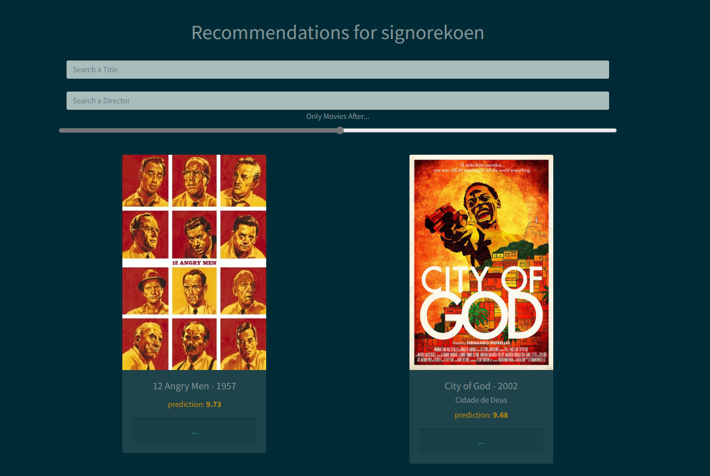

# Letterboxd Movie Recommendations
Personalized Movie Recommendations based on your Letterboxd account using Funk SVD algorithm

This is an old hobby project. Originally created during the summer of 2020. 

This repo contains
- Some code to scrape Letterboxd (when this project was written, Letterboxd did 
not have a public API yet).
- A custom implementation of the Funk SVD recommendation algorithm in NumPy. The
implementation uses Numba to get significant performance benefits.
- A small web application. It will ask you for your Letterboxd username, scrape
your movie diary and give recommendations based on the trained model. 

Note that the model in this repo was trained on data scraped in the summer of 2020, 
so you should not expect to see any movie recommendations of movies released after 2020. 

The model in this repo was trained on almost 5 million ratings, distributed over 
the 5k most popular users of Letterboxd (in the summer of 2020) and 12k movies. The
file with raw ratings contains even more ratings (more than 100k movies), but movies
with a low number of ratings were excluded during training. 

The project was uploaded in 2023 and checked to work with Python 3.11. Some changes made:
- Removed unfinished parts
- Data was previously stored in pickle format and in a sqlite database. This data is now stored
in json and csv files and functions are written to read these formats. 

## Running
- Install the requirements
- Run the file ``main.py``

